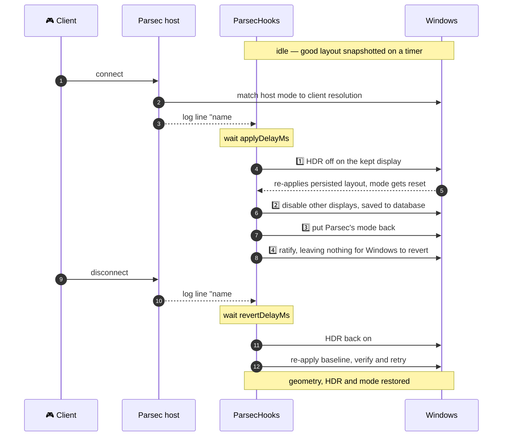

<div align="center">

# 🖥️ ParsecHooks

**Automatic display and HDR tuning for Windows Parsec hosts.**
Turns off the monitors you don't stream, drops HDR while you play, and puts everything back
*exactly* as it was when you disconnect.


</div>

---

## ✨ What it does

While a Parsec client is connected:

| | Action | Detail |
|:--:|---|---|
| 🌙 | **Blanks the other panels over DDC/CI** | `standbySecondaryMonitors` — the monitor stays *attached* but its panel powers down, saving pixels and watts. Woken on disconnect |
| 🖼️ | **Moves desktop icons onto the visible primary** | `moveIconsToPrimary` — Parsec shrinks the primary to the client's resolution, stranding icons off-screen. Original layout restored on disconnect |
| 🎨 | **Turns HDR off** | Only where it was actually *on* — Parsec captures HDR poorly, so streams look washed out |
| 📐 | **Leaves resolution to Parsec** | Parsec already matches the client and re-enforces it; we only make sure our own changes don't disturb it |
| 🌑 | **Disables every other display** | `disableSecondaryMonitors` — **off by default, and best left that way.** See below |

> [!WARNING]
> **Do not use `disableSecondaryMonitors`.** Deactivating a display path leaves phantom
> monitor registrations that Windows re-enumerates every ~9.2 s. Each one invalidates
> Desktop Duplication, so Parsec rebuilds its whole NVENC pipeline — a ~500 ms freeze on
> the client, twice, every ten seconds. Measured with [`tools/lagwatch`](tools/lagwatch):
> 5–12 invalidations per 25 s that way, **0** with `standbySecondaryMonitors` instead.
> Same dark panel, none of the stutter.

When the last client disconnects, the **exact** prior state comes back: monitor positions,
resolutions, fractional refresh rates (`179.998Hz`, not `180`), and HDR.

> [!IMPORTANT]
> **Resolution is deliberately not managed.** Parsec sets the host to the client's resolution and
> re-enforces that choice roughly every 10 seconds. Anything this tool sets gets overridden and
> the picture visibly flaps between the two. See [finding 5](#finding-5).

### 🔄 A session, end to end



---

## 📑 Contents

- [Quick start](#-quick-start)
- [Why no third-party tools](#-why-no-third-party-tools)
- [Tray menu](#-tray-menu)
- [Settings dialog](#-settings-dialog)
- [Configuration](#-configuration)
- [Reading the log](#-reading-the-log)
- [What Windows actually does](#-what-windows-actually-does) ← the interesting part
- [Known limitations](#-known-limitations)
- [Testing](#-testing)
- [Project layout](#-project-layout)

---

## 🚀 Quick start

```bat
build.cmd        :: compile bin\ParsecHooks.exe with the compiler already inside Windows
install.cmd      :: register at logon and launch
uninstall.cmd    :: revert any active tweaks, stop it, remove the registration
```

Then look for the 🖥️ icon in the notification area. Right-click, or double-click, for **Settings**.

**Requirements**

- Windows 10 1709+ / Windows 11 — developed and verified on **Windows 11 25H2, build 26200**
- .NET Framework 4.x — already on every supported Windows install
- Parsec host running under **your** user account (not SYSTEM — see [finding 9](#finding-9))

> [!NOTE]
> No admin rights anywhere. Display topology, resolution and HDR all change unelevated, so setup
> writes a plain `HKCU` Run value instead of a scheduled task and never triggers a UAC prompt.

**Escape hatches**

```bat
bin\ParsecHooks.exe --revert      :: restore displays and HDR, then exit
bin\ParsecHooks.exe --settings    :: open just the settings dialog
```

`--revert` reads the state file that is written *before* any change is applied, so it works even
if the tray app is dead. Failing that: `Win`+`P` → **Extend**.

---

## 🧰 Why no third-party tools

Everything goes through Win32 directly:

| Job | Mechanism |
|---|---|
| Enable/disable individual monitors | `QueryDisplayConfig` + `SetDisplayConfig` |
| Read HDR state | `DISPLAYCONFIG_DEVICE_INFO_GET_ADVANCED_COLOR_INFO_2` → falls back to `..._GET_ADVANCED_COLOR_INFO` |
| Set HDR state | `DISPLAYCONFIG_DEVICE_INFO_SET_HDR_STATE` → falls back to `..._SET_ADVANCED_COLOR_STATE` |
| Put a mode back after our own changes | `EnumDisplaySettingsEx` + `ChangeDisplaySettingsEx` |
| Detect connect/disconnect | tail Parsec's own `log.txt` |
| Tray icon | WinForms `NotifyIcon` |

So there is no need for `HdrSwitcher`, `HDRCmd`, `HDRTray`, `HDRSwitch`, `Win`+`Alt`+`B`
simulation, the `DisplayConfig` PowerShell module, NirSoft `MultiMonitorTool` /
`ControlMyMonitor`, `DisplaySwitch.exe`, or AutoHotkey.

`DisplaySwitch /internal` would have been the wrong tool anyway: it resets your monitor
arrangement and cannot restore a custom layout.

> [!TIP]
> **Building.** `build.cmd` uses `%WINDIR%\Microsoft.NET\Framework64\v4.0.30319\csc.exe`. Because
> that is the .NET **Framework** compiler, the source is restricted to **C# 5** — no string
> interpolation, no `?.`, no expression-bodied members. Keep it that way or the build breaks.

<details>
<summary><b>Two build gotchas worth knowing</b></summary>

<br>

**`app.manifest` must not contain a double hyphen in an XML comment.** It is embedded via
`/win32manifest` for DPI awareness (so the settings dialog renders sharp rather than
bitmap-stretched) and a `supportedOS` block. An invalid manifest makes Windows refuse to start
the exe at all, with *"the side-by-side configuration is incorrect"* — and the event log blames
the wrong line.

**Auto-start uses `HKCU\…\CurrentVersion\Run`**, not a Startup-folder shortcut, so the settings
checkbox can toggle it without COM interop. A shortcut left by an older install is migrated
automatically on first launch, so the app is never registered twice.

</details>

---

## 🎛️ Tray menu

| Item | What it does |
|---|---|
| *(top line)* | current state and connected client count |
| **⚙️ Settings…** | the settings dialog — also opened by double-clicking the icon |
| **📊 Show status…** | live display list, HDR per display, and the saved baseline |
| **▶️ Apply tweaks now** | applies immediately, for testing |
| **↩️ Revert now** | undo this session's tweaks right now |
| **🛟 Reset displays to default** | the real escape hatch — wakes every panel, restores the saved topology, resolution and HDR, and puts the icons back. Works even if nothing is applied, and after a crash. Also `ParsecHooks.exe --reset-default` |
| **💾 Save current layout as default** | remember what is on screen now as the layout that button returns to. Also `ParsecHooks.exe --save-default` |
| **⏸️ Pause automation** | stop reacting to connects until unchecked |
| **🔁 Reload config from file** | re-read the ini by hand (normally unnecessary) |
| **📂 Open parsec-hooks log** / **Open Parsec log** | jump to either log |
| **❌ Exit** | reverts first, then quits |

**Icon colour:** ⚫ grey = idle · 🟢 green = tweaks applied · 🟠 amber = paused

---

## ⚙️ Settings dialog

Everything is configurable by clicking; you never have to open the ini.

| Tab | Contains |
|---|---|
| **Displays & HDR** | Which display to keep — a dropdown of your *actual* monitors with resolutions and target ids, so there is nothing to type. Plus whether to switch the others off, whether to turn HDR off, and the HDR scope. |
| **Timing** | Apply / revert / settle delays and the re-assert guard interval. |
| **Advanced** | Start-at-logon toggle, tray notifications, log verbosity, poll and re-snapshot intervals, a Parsec log path override with a file picker, and buttons that open either log or the config file. |

A live status line along the bottom always shows the current display count, which displays have
HDR on, and whether Parsec and its log were found.

**OK** and **Apply** take effect immediately — no restart. Changes made *outside* the app are
picked up too: the config file's timestamp is polled, so editing the ini by hand or running
`--settings` from elsewhere reloads within a second. *Reload config from file* is only a manual
nudge.

> [!TIP]
> The start-at-logon checkbox also reports when auto-start is registered but has been switched
> off in **Task Manager → Startup apps**. Windows records that separately from the registry value,
> so without the extra check the box would claim auto-start is on while Windows quietly ignores it.

---

## 🔧 Configuration

Use **Settings…**. The table below documents the underlying `bin\parsec-hooks.ini`, which is
created with commented defaults on first run and rewritten — comments and all — whenever you save
from the dialog.

| Key | Default | Meaning |
|---|:--:|---|
| `keep` | `primary` | Display to keep on: `primary`, a CCD target id, or a substring of the monitor name / device path |
| `disableSecondaryMonitors` | `true` | Turn the other displays off during a session |
| `disableHdr` | `true` | Turn HDR off during a session, only where it was on |
| `hdrScope` | `kept` | `kept` = only displays left enabled · `all` = every active display |
| `applyDelayMs` | `1200` | Wait after `connected.` before touching displays |
| `revertDelayMs` | `2000` | Wait after the last `disconnected.` before reverting; also debounces reconnects |
| `settleMs` | `400` | Pause between the HDR change and the topology change |
| `pollMs` | `750` | Parsec log poll interval |
| `baselineRefreshMs` | `15000` | How often to re-snapshot the good layout — **only ever while idle** |
| `guardMs` | `5000` | Re-assert interval while a session is active; `0` disables |
| `logPath` | *(blank)* | Override the Parsec log path; blank = auto-detect |
| `logLevel` | `info` | `debug` · `info` · `warn` · `error` |
| `notifications` | `true` | Tray balloon tips |

Its own log lives at `%LOCALAPPDATA%\parsec-hooks\parsec-hooks.log` and rotates at 1 MB.

---

## 🔍 Reading the log

Every display change is traced *with its origin*, which is what turns "it reverted after a while"
into something diagnosable:

```text
Apply: state before -> 2 active | AW3423DWF* 3440x1440@165 HDR=ON | GF270C 1920x1080@180 HDR=off
HDR off on AW3423DWF (tgt 4353) via SET_HDR_STATE
disabled 1 display(s): GF270C (tgt 4355)
[apply] our own changes had reset the mode to 3440x1440@165; put the client's 1280x800@60 back
[apply] ratified current layout so Windows stops reverting it: 1 active | AW3423DWF* 1280x800@60
Apply: state after  -> 1 active | AW3423DWF* 1280x800@60 HDR=off
```

| Marker | Meaning |
|---|---|
| `(EXTERNAL - not initiated by parsec-hooks)` | 🚨 **something else** moved your displays. The lines after it show what was corrected. |
| `(ours)` | ✅ the change was one of ours, and expected. |
| `ratified current layout` | the live state was written into Windows' display database, so Windows has nothing left to revert. |

Set `logLevel = debug` to also see `CHANGING` events and debounce decisions.

---

## 🧠 What Windows actually does

> Every claim below was **measured on the target machine**, not assumed. Several are the opposite
> of what the documentation implies, and findings 1–4 interlock: each fix exposed the next one.

<details>
<summary><b>🔴 1. An HDR change makes Windows re-apply its persisted display layout</b></summary>

<br>

The single most important finding. A topology change applied *without* `SDC_SAVE_TO_DATABASE` is
silently reverted by any later HDR change. Measured active-display counts:

```text
disable secondary   -> 1 1 1 1 1 1
then HDR off        -> 2 2 2 2 2 2 2 2      ← the monitor came back
```

So **HDR is always changed first and topology last** — on apply, on revert, on crash recovery,
and in `--revert`.

</details>

<details>
<summary><b>🔴 2. That re-apply restores the persisted MODE too, not just the topology</b></summary>

<br>

This is what made a working session silently fall back to native resolution. The re-apply does
not merely re-enable monitors — it puts the resolution back as well:

```text
set 1280x800 (transient)   -> 1280x800  1280x800  1280x800  1280x800
then toggle HDR            -> 3440x1440 3440x1440 3440x1440 ...
```

An HDR change is only the most *reproducible* trigger; Windows also does this for driver and
monitor events. So anything can knock a session's mode back to native at any moment.

</details>

<details>
<summary><b>🔴 3. A transient topology change makes Windows fight you forever</b></summary>

<br>

Applying the session topology without `SDC_SAVE_TO_DATABASE` leaves the display database
disagreeing with reality — and Windows then re-applies the database **unprompted, roughly every
10–12 seconds**:

```text
19:28:05  Apply: state after -> 1 active | AW3423DWF* 1280x800@60 HDR=off
19:28:18  display settings CHANGED (EXTERNAL) -> 2 active | 3440x1440@165
```

Each re-apply re-enables the monitor *and* resets the resolution (finding 2). The guard won the
monitor back but the resolution stayed lost, so a real Steam Deck session flapped between
`1280x800` and `3440x1440` indefinitely.

The session topology is therefore applied **with** `SDC_SAVE_TO_DATABASE`, removing the
disagreement so there is nothing left to restore.

> [!WARNING]
> The cost: a hard power-off *mid-session* boots with the monitor still disabled. That is covered
> by the applied-state file, which the app restores at logon, and by `--revert`. Reverting always
> persists the baseline back.

A consequence worth knowing: because the persisted layout *during* a session is the reduced one,
the HDR restore at the start of a revert triggers a re-apply of that reduced layout, which can
land **after** the baseline restore and switch the monitor off again. The baseline restore
therefore verifies and retries up to three times.

</details>

<details>
<summary><b>🔴 4. Persisting is still not enough — the final state must be ratified</b></summary>

<br>

Even with findings 1–3 handled, our own sequence leaves live state and database disagreeing:

1. HDR off → Windows re-applies the database → the mode reverts to native.
2. We persist the reduced topology — *while the mode is still that clobbered native one*.
3. We repair the mode back to Parsec's value, but `ChangeDisplaySettingsEx` with `flags = 0` is
   **transient**.

Net result: the database says native, the screen says `1280x800`, and Windows re-asserts the
database every ~10 seconds. Measured, with Parsec only slowly winning it back:

```text
20:00:57  put the client's 1280x800@60 back      (our repair, transient)
20:01:07  CHANGED -> 3440x1440@165               Windows re-applies the database
20:01:42  CHANGED[EXT] -> 1280x800@60            Parsec restores it, 35s later
20:01:47  CHANGED -> 3440x1440@165               and Windows reverts it again
```

So once our changes settle we **ratify**: re-apply the *current* configuration with
`SDC_SAVE_TO_DATABASE` and **no modifications**. That makes live == database, leaving Windows
nothing to revert.

Ratifying never *chooses* a mode. It only makes whatever is already on screen authoritative —
which is also why a resolution you change mid-session on the client now sticks instead of being
undone.

</details>

<a id="finding-5"></a>
<details>
<summary><b>🟡 5. Resolution belongs to Parsec</b></summary>

<br>

Parsec sets the host to the client's resolution *before* we even see the connect line, then
re-enforces that choice on a ~10 second cycle — its log shows
`hosting: Initial /me interval set to 10.000000 seconds`. Anything we set is overridden, and if
we re-assert ours, the two of us trade the mode back and forth for the whole session:

```text
19:48:37  resolution 3440x1440@165 -> 1280x800@60 -> OK      (our apply)
19:48:48  CHANGED -> 3440x1440@165
19:48:52  guard: resolution drifted; restoring
19:48:53  guard: resolution restored (1280x800@165 -> OK)
19:48:56  CHANGED[EXT] -> 3440x1440@165
19:49:07  …  19:49:17  …  19:49:27  …                        every ~10s, indefinitely
```

**So there is no resolution setting at all.** The only mode call left is a repair: our HDR and
topology changes reset it as a side effect, so we put back exactly what was there beforehand —
Parsec's own value, refresh rate included.

Two dead ends worth recording, because both look perfectly reasonable:

| Attempt | Why it failed |
|---|---|
| Force a size, e.g. `1280x800` | With no refresh rate that resolves to the panel maximum (`@165`) while Parsec wants `@60`, so Parsec re-enforces forever |
| Force size *and* rate, and hold it | Still fights — Windows' persisted-layout re-apply and Parsec's own cycle both keep moving it |

</details>

<details>
<summary><b>🟠 6. <code>SDC_ALLOW_CHANGES</code> lets <code>SetDisplayConfig</code> rewrite your arrays</b></summary>

<br>

With `SDC_ALLOW_CHANGES`, `SetDisplayConfig` may modify the path/mode arrays you pass it. So
validating with the same arrays you then apply makes the validation pass **overwrite your
intent** — it rewrites the config back to what is already active, and the following `SDC_APPLY`
reports *success while changing nothing*.

Both calls therefore get throwaway copies, and the long-lived baseline snapshot is never handed
to the API directly.

Because of this class of bug, every topology change is **verified against `QueryDisplayConfig`
afterwards** rather than trusting the return code.

</details>

<details>
<summary><b>🟠 7. Never build a topology change from a stale snapshot</b></summary>

<br>

Disabling a monitor means calling `SetDisplayConfig` with path **and mode** arrays — so those
arrays carry a resolution whether you meant them to or not. The first version built them by
cloning the idle baseline, which quietly made this tool fight Parsec:

| | `encode_x`/`encode_y` | `host_sys_display_1_width` |
|---|:--:|:--:|
| without ParsecHooks | 1280 × 800 | 1280 × 800 |
| with ParsecHooks | **3440 × 1440** | **3440 × 1440** ← baseline re-applied |

Parsec matched the client correctly, then ~1.2 s later our apply overwrote it, and the guard
re-asserted that stale snapshot every 5 s so Parsec could never win. It also showed up as three
`DXGI_ERROR_ACCESS_LOST` encoder restarts per session instead of one.

Both the apply and the guard now build the reduced topology from a **live** `QueryDisplayConfig`,
so they only ever clear active flags. Snapshots are used for exactly one thing: restoring on
disconnect.

</details>

<details>
<summary><b>🟠 8. Parsec rewrites your primary display's mode mid-session</b></summary>

<br>

`metrics_host.json` showed display 1 running at `1280x800@60` against a maximum of `3440x1440` —
Parsec had matched the host to the connecting Steam Deck.

So a snapshot taken *at connect time* captures Parsec's already-modified mode and would later
"restore" you to 1280x800. The baseline is therefore only ever captured **while no client is
connected**: on a timer, and immediately on becoming idle. If the app starts while a session is
already live it declines to snapshot at all and stays hands-off until the session ends.

</details>

<a id="finding-9"></a>
<details>
<summary><b>🔵 9. The log location does not follow the install type</b></summary>

<br>

This machine has a **per-machine** install (`C:\Program Files\Parsec`) but a **per-user** log
(`%APPDATA%\Parsec\log.txt`) — `%ProgramData%\Parsec` does not exist at all. `parsecd.exe` runs
as the logged-in user, launched by the Parsec service. Both locations are probed, `%APPDATA%`
first, and the candidate list is re-checked periodically so an explicitly configured path is
picked up once it appears.

> [!WARNING]
> Run this as your normal user, **not** as SYSTEM, or `%APPDATA%` resolves to the wrong profile.

</details>

<details>
<summary><b>🔵 10. Matching connect lines without false positives</b></summary>

<br>

```text
[I 2026-04-21 19:07:40] someone#1234567 connected.
[I 2026-08-10 20:11:05] someone#1234567 disconnected.
[F 2026-08-11 17:23:28] ===== Parsec: Started =====
```

The matcher is anchored, case-sensitive, restricted to the `[I]` level, and requires a
`name#digits` user token. Against 5151 lines of real history: **5 connects, 5 disconnects,
perfectly balanced, zero false positives.**

It deliberately rejects `[D] IPC AS Client Connected.` — which occurs **84 times** in that log
and would fire on any case-insensitive *"ends with connected."* check — plus
`UPNP: … reported as not connected`, `Client '…' went dormant`, and `disconnected.` lines.

`===== Parsec: Started =====` means "all previous sessions are dead", both while tailing and when
reconciling at startup.

</details>

<details>
<summary><b>🔵 11. Other robustness details</b></summary>

<br>

- **Log rotation** — Parsec rotates `log.txt` at roughly 1 MB. A shrinking file is detected and
  re-read from the start, and a stateful UTF-8 decoder handles multi-byte characters split across
  read boundaries.
- **Startup reconciliation** — only the log tail since the last restart marker is replayed, so
  starting at boot does not replay months of history, and starting mid-session is not blind.
- **Multiple clients** — tracked as a set. Tweaks apply once on 0→1 and revert only on →0.
- **Crash safety** — the state file is written *before* changes are announced and deleted on
  revert. Finding it at startup means the previous run died mid-session; it is restored at once.
- **Never blacks out everything** — if the `keep` selector matches no display, the change is
  refused and logged.
- **Parsec disappearing** — if `parsecd.exe` vanishes while clients are tracked, that counts as a
  disconnect.
- **Self-inflicted change detection** — `WM_DISPLAYCHANGE` lands 100–400 ms after the call that
  caused it, so a grace window keeps our own changes from looking external and triggering a
  feedback loop.
- Reverts also run on **Exit** and on **logoff/shutdown**.

</details>

---

## ⚠️ Known limitations

| Limitation | Detail |
|---|---|
| 🪟 **Windows move off a disabled monitor and don't move back** | How Windows behaves when a display is disabled; not something this app undoes. The accepted trade-off for your remote cursor not wandering onto an off-screen desktop. Set `disableSecondaryMonitors = false` to keep only the HDR behaviour. |
| 🎯 **`host_output` is not decoded** | Parsec's `config.json` pins which monitor it streams (`"host_output": "<opaque-id>"`) and the format is undocumented, so *"keep whichever monitor Parsec streams"* cannot be done reliably — hence `keep = primary`. If you stream a non-primary display, set `keep` to that monitor's name or target id. |
| 📺 **Aspect ratio is Parsec's business** | A 21:9 primary gives a 16:10 client a letterboxed image. Parsec's own resolution matching handles this; a virtual display would handle it more cleanly, but that needs a driver and is out of scope. |
| ⚡ **A power-cut mid-session leaves the monitor off** | The session layout is persisted (finding 3). The app restores it at logon from the state file, and `--revert` does it manually. |
| 🔌 **`DXGI_ERROR_ACCESS_LOST` in Parsec's log** | Normal. It appears about a second after each connect and Parsec immediately re-acquires capture. Happens with or without this tool, and is why changing displays mid-session is safe. |

---

## 🧪 Testing

```powershell
.\test\run-tests.ps1
```

A **68-check suite** that drives the real exe against a synthetic Parsec log (via the `logPath`
override) and asserts *real* display state through an independent CCD/GDI probe — never through
the app's own reporting. Everything machine-specific is detected at startup, so the
exact-restoration checks work on any setup. See [test/README.md](test/README.md).

| Area | Covered |
|---|---|
| Detection | noise rejection, wrong-log-level lines, sentinel ordering, log rotation, log deletion, log re-detection |
| Sequencing | single and multi-client, apply once on 0→1, revert only on →0, reconnect debouncing |
| Fidelity | exact position `(-1920,165)`, fractional refresh `179.998Hz`, native `3440x1440` restored |
| Resilience | 8-second stability hold, injected external drift with guard re-assertion, kill-while-applied crash recovery |
| Plumbing | automatic reload of an externally edited config, auto-start registration, legacy shortcut migration |

The decisive case — a client-negotiated mode surviving a whole session, sampled across several of
those ~10 s re-apply windows:

```text
staged client mode: 1280x800@60
after apply:        displays=1  mode=1280x800@60
mode over 40s:      1280x800@60 ×20        ← no reverting
after revert:       displays=2  mode=3440x1440@165  HDR=on
```

> [!NOTE]
> The settings dialog was verified by launching `--settings`, capturing each tab and **looking at
> the result**. Worth doing rather than assuming: it caught two layout faults that compile and run
> perfectly happily — a `Form` with `AutoSize` around docked children collapsing to 132 px wide,
> and `FlowLayoutPanel.WrapContents` defaulting to `true`, which silently wrapped **Cancel** and
> **Apply** out of view and left a dialog whose only button was OK.

---

## 📁 Project layout

```text
ParsecHooks/
├── build.cmd            # compile with the in-box csc.exe
├── install.cmd          # register at logon + launch
├── uninstall.cmd        # revert, stop, deregister
├── app.manifest         # DPI awareness + supportedOS
└── src/
    ├── Program.cs        # entry point, single-instance guard, --revert / --settings
    ├── HookApp.cs        # tray icon, timers, connect/disconnect state machine
    ├── DisplayManager.cs # CCD topology + HDR + mode, snapshot/restore, persistence
    ├── Native.cs         # Win32 interop (CCD structs, GDI mode APIs)
    ├── ParsecWatcher.cs  # log discovery, tailing, session tracking
    ├── SettingsForm.cs   # the settings dialog
    ├── AutoStart.cs      # HKCU Run registration + legacy shortcut migration
    └── Util.cs           # config, logging, paths
```

`bin/` is generated and git-ignored — `build.cmd` recreates the exe in a couple of seconds, and
`bin\parsec-hooks.ini` is per-machine config the app writes itself.

---

## 📄 License

[MIT](LICENSE) — do what you like with it, no warranty.

<div align="center">
<br>
<sub>Built for a Steam Deck streaming an ultrawide QD-OLED, which is exactly the setup that
surfaced every one of the findings above.</sub>
</div>
